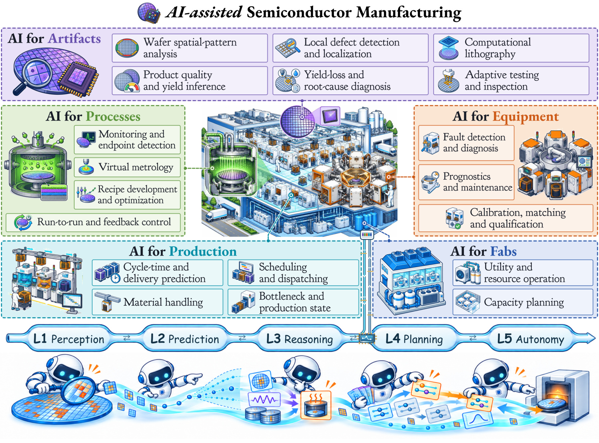

<h1 align="center">From Perception to Autonomy</h1>

<h3 align="center">A Survey on AI-Assisted Semiconductor Manufacturing</h3>

  Rui Zhong · Zhikun Huang · Xue Zhang · Qian Jin · Yu Li 
  Qi Sun · Dawei Gao · Yi Song · Hanming Wu · Cheng Zhuo

Zhejiang University &nbsp; · &nbsp; Zhejiang ICsprout Semiconductor Co., Ltd.

<!-- BEGIN COUNTS -->

  
  
  

<!-- END COUNTS -->

  <a href="#browse-by-manufacturing-task"><b>Paper collection</b></a> &nbsp; / &nbsp;
  <a href="RESOURCES.md"><b>Datasets &amp; code</b></a> &nbsp; / &nbsp;
  <a href="docs/getting-started.md"><b>Reading guide</b></a> &nbsp; / &nbsp;
  <a href="docs/citation.md"><b>Citation</b></a>

  

Five manufacturing scopes. Nineteen tasks. From interpreting observations to acting and learning through feedback.

AI can help find defects, predict process results, diagnose tool faults and coordinate a factory. This collection organizes the literature around **what needs to be understood, predicted or changed in manufacturing**, connecting AI methods to the decisions they support.

The repository accompanies our survey and welcomes new papers, datasets and implementations. The preprint link will be added when it is available.

## Browse by manufacturing task

Choose a scope below to explore its tasks and papers. Each list is ordered newest first, with links to the original publications and available resources.

<!-- BEGIN TASKS -->
<table>
<tr>
<td width="50%" valign="top">
<h3><a href="papers/artifacts.md">A · Artifacts</a></h3>

<b>223 papers</b> · 6 tasks

Products and their structures, from wafer patterns and local defects to masks, quality and yield.

<ul>
<li><a href="papers/artifacts.md#a1">A1 · Wafer spatial-pattern analysis</a> (43)</li>
<li><a href="papers/artifacts.md#a2">A2 · Local defect detection and localization</a> (44)</li>
<li><a href="papers/artifacts.md#a3">A3 · Computational lithography</a> (67)</li>
<li><a href="papers/artifacts.md#a4">A4 · Product quality and yield inference</a> (23)</li>
<li><a href="papers/artifacts.md#a5">A5 · Yield-loss diagnosis and root-cause analysis</a> (30)</li>
<li><a href="papers/artifacts.md#a6">A6 · Adaptive testing and inspection</a> (16)</li>
</ul>
</td>
<td width="50%" valign="top">
<h3><a href="papers/processes.md">P · Processes</a></h3>

<b>116 papers</b> · 4 tasks

Manufacturing operations: monitoring their progress, estimating results and choosing or adjusting settings.

<ul>
<li><a href="papers/processes.md#p1">P1 · Process monitoring and endpoint detection</a> (41)</li>
<li><a href="papers/processes.md#p2">P2 · Virtual metrology</a> (36)</li>
<li><a href="papers/processes.md#p3">P3 · Process development and recipe optimization</a> (19)</li>
<li><a href="papers/processes.md#p4">P4 · Run-to-run and feedback control</a> (20)</li>
</ul>
</td>
</tr>
<tr>
<td width="50%" valign="top">
<h3><a href="papers/equipment.md">E · Equipment</a></h3>

<b>50 papers</b> · 3 tasks

The tools and chambers that carry out operations, including their health, maintenance and readiness.

<ul>
<li><a href="papers/equipment.md#e1">E1 · Fault detection and diagnosis</a> (25)</li>
<li><a href="papers/equipment.md#e2">E2 · Prognostics and maintenance</a> (22)</li>
<li><a href="papers/equipment.md#e3">E3 · Calibration, matching and qualification</a> (3)</li>
</ul>
</td>
<td width="50%" valign="top">
<h3><a href="papers/production.md">R · Production</a></h3>

<b>55 papers</b> · 4 tasks

The movement and processing of lots through shared machines, queues and transport systems.

<ul>
<li><a href="papers/production.md#r1">R1 · Cycle-time and delivery prediction</a> (6)</li>
<li><a href="papers/production.md#r2">R2 · Scheduling and dispatching</a> (30)</li>
<li><a href="papers/production.md#r3">R3 · Material handling</a> (7)</li>
<li><a href="papers/production.md#r4">R4 · Bottleneck and production-state analysis</a> (12)</li>
</ul>
</td>
</tr>
<tr>
<td width="50%" valign="top">
<h3><a href="papers/fabs.md">F · Fabs</a></h3>

<b>31 papers</b> · 2 tasks

Factory utilities and longer-term capacity decisions that support production.

<ul>
<li><a href="papers/fabs.md#f1">F1 · Utility and resource operation</a> (18)</li>
<li><a href="papers/fabs.md#f2">F2 · Capacity planning</a> (13)</li>
</ul>
</td>
<td width="50%" valign="top">
<h3>New to the field?</h3>

Start with the manufacturing problem, then follow the data, model and decision.

<ul>
<li><a href="docs/getting-started.md">A chip’s path through a factory</a></li>
<li><a href="docs/getting-started.md#choose-a-reading-path">Reading paths for AI researchers</a></li>
<li><a href="docs/getting-started.md#terms-you-will-meet">Manufacturing glossary</a></li>
<li><a href="RESOURCES.md">Datasets and implementations</a></li>
</ul>
</td>
</tr>
</table>
<!-- END TASKS -->

## Start exploring

| Find papers | Try an implementation | Work with the catalogue |
| :--- | :--- | :--- |
| [Wafer patterns](papers/artifacts.md#a1) · [Defect detection](papers/artifacts.md#a2) [Virtual metrology](papers/processes.md#p2) · [Scheduling](papers/production.md#r2) | [MixedWM38](RESOURCES.md#mixedwm38) · [LithoBench](RESOURCES.md#lithobench) [SECOM](RESOURCES.md#secom) · [PySCFabSim](RESOURCES.md#pyscfabsim) | [BibTeX](references.bib) · [CSV](data/papers.csv) · [JSON](data/papers.json) [Data format](data/README.md) · [Citation](docs/citation.md) |

New to the field? The [reading guide](docs/getting-started.md) introduces manufacturing terms, explains the five AI stages and suggests paths from familiar AI problems to factory decisions.

## Contribute

Help the collection grow: [suggest a paper or resource](https://github.com/zrrraa/Awesome-AI-Assisted-Semiconductor-Manufacturing/issues/new/choose), report a correction, or submit a pull request. See the [contribution guide](CONTRIBUTING.md) for the format and scope.

If you use this collection, please [cite the survey](docs/citation.md) and the original papers or resources that inform your work.

## Updates

- **2026-10-08** — Initial release: 475 manufacturing studies across 19 tasks, with public resources and a reading guide.
