<h1 align="center">Awesome AI-Assisted Semiconductor Manufacturing</h1>
<p align="center"><b>From Perception to Autonomy: A Survey on AI-Assisted Semiconductor Manufacturing</b></p>

<p align="center">
  <a href="https://awesome.re"></a>
  <a href="https://zrrraa.github.io/Awesome-AI-Assisted-Semiconductor-Manufacturing/"></a>
  <a href="#citation"></a>
  <a href="CONTRIBUTING.md"></a>
</p>

<p align="center"><span><a href="mailto:rzhong@zju.edu.cn">Rui Zhong</a><sup>1</sup></span> · <span><a href="mailto:3230106225@zju.edu.cn">Zhikun Huang</a><sup>1</sup></span> · <span>Xue Zhang<sup>1</sup></span> · <span><a href="mailto:jinqian2022@zju.edu.cn">Qian Jin</a><sup>1</sup></span> · <span><a href="mailto:li.yu@zju.edu.cn">Yu Li</a><sup>1</sup></span><br>
<span><a href="mailto:qisunchn@zju.edu.cn">Qi Sun</a><sup>1</sup></span> · <span><a href="mailto:dawei_gao@zju.edu.cn">Dawei Gao</a><sup>2,1</sup></span> · <span><a href="mailto:yi.song@zju.edu.cn">Yi Song</a><sup>1</sup></span> · <span><a href="mailto:hanmingwu@zju.edu.cn">Hanming Wu</a><sup>1,*</sup></span> · <span><a href="mailto:czhuo@zju.edu.cn">Cheng Zhuo</a><sup>1,*</sup></span></p>
<p align="center"><sub><span><sup>1</sup> College of Integrated Circuits, Zhejiang University</span> &nbsp; <span><sup>2</sup> Zhejiang ICsprout Semiconductor Co., Ltd.</span><br>* Corresponding authors.</sub></p>

<p align="center">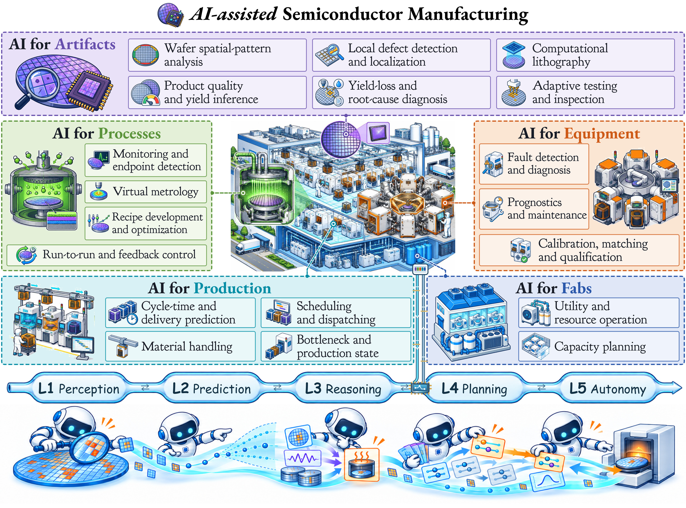</p>

<p align="center">
  <a href="https://zrrraa.github.io/Awesome-AI-Assisted-Semiconductor-Manufacturing/">🌐 <b>Project page</b></a> &nbsp; · &nbsp;
  <a href="#news">🔥 <b>News</b></a> &nbsp; · &nbsp;
  <a href="#citation">📝 <b>Citation</b></a> &nbsp; · &nbsp;
  <a href="#papers">📚 <b>Papers</b></a> &nbsp; · &nbsp;
  <a href="docs/getting-started.md">🧭 <b>Reading guide</b></a>
</p>

<a id="news"></a>

## 🔥 News

- **2026-10-10** — A new [project page](https://zrrraa.github.io/Awesome-AI-Assisted-Semiconductor-Manufacturing/) brings together the survey story, visual task navigation and our growing paper collection.
- **2026-10-08** — Task-based reading lists and the survey companion are online.

<a id="citation"></a>

## 📝 Citation

If you find the survey useful, please cite it:

<details>
<summary><b>Copy BibTeX</b></summary>

```bibtex
@unpublished{zhong2026perception,
  title = {From Perception to Autonomy: A Survey on {AI}-Assisted Semiconductor Manufacturing},
  author = {Zhong, Rui and Huang, Zhikun and Zhang, Xue and Jin, Qian and Li, Yu and Sun, Qi and Gao, Dawei and Song, Yi and Wu, Hanming and Zhuo, Cheng},
  year = {2026},
  note = {Manuscript}
}
```

</details>

## 💡 From manufacturing data to manufacturing decisions

Making a chip means coordinating many steps: patterns must be printed, processes adjusted, tools kept healthy, and wafers moved through a busy factory. AI can help at every step—but a better prediction does not automatically lead to a better manufacturing outcome.

Our survey follows the decisions behind these tasks. It connects **five manufacturing scopes** and **nineteen tasks** with five AI stages: **Perception → Prediction → Reasoning → Planning → Autonomy**. The central question is how observations become useful actions, and how feedback makes those actions better.

<p align="center">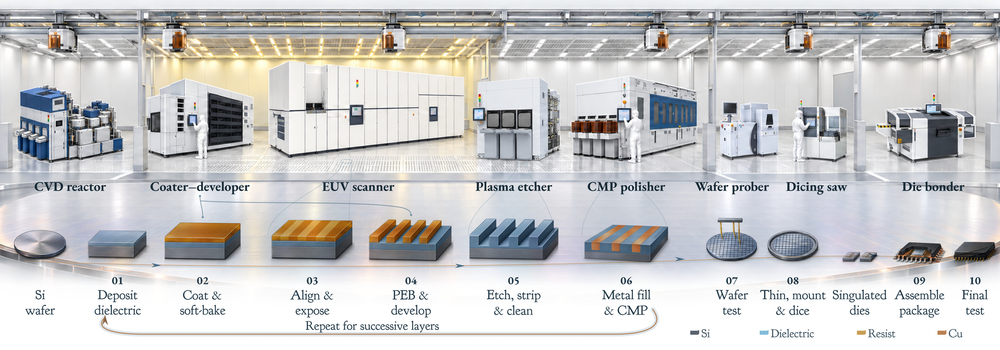</p>

**Three ideas run through the review:**

- **Keep the context.** Where and when a measurement is made can matter as much as its value.
- **Connect predictions to decisions.** Diagnose a cause, choose the next measurement, adjust a process or coordinate factory resources.
- **Learn from what happens next.** Actions change the factory and the data that future models learn from.

Together, these findings motivate an **AI-native autonomous virtual fab**: models, agents and physical systems working together to support factory decisions and improve through operating experience.

<a id="papers"></a>
<a id="browse-by-manufacturing-task"></a>

## 📚 Explore by manufacturing task

Start from a manufacturing question, then follow the papers. New to the field? See the [reading guide](docs/getting-started.md).

<table>
<tr><td colspan="2" width="900"><h3><a href="papers/artifacts.md">Artifacts</a></h3><b>What are we making?</b><br>Products, patterns and quality.</td></tr>
<tr>
<td width="50%" valign="top"><a href="papers/artifacts.md#a1">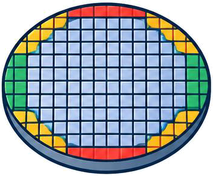<br><b>A1 · Wafer spatial-pattern analysis</b></a><br><sub>What does the spatial pattern of failing dies reveal about a wafer?</sub></td>
<td width="50%" valign="top"><a href="papers/artifacts.md#a2">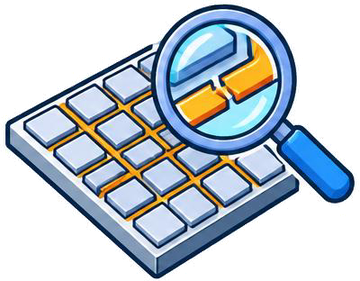<br><b>A2 · Local defect detection and localization</b></a><br><sub>Where is a defect, and what does it look like?</sub></td>
</tr>
<tr>
<td width="50%" valign="top"><a href="papers/artifacts.md#a3"><br><b>A3 · Computational lithography</b></a><br><sub>Which mask pattern will print the intended structure on a wafer?</sub></td>
<td width="50%" valign="top"><a href="papers/artifacts.md#a4">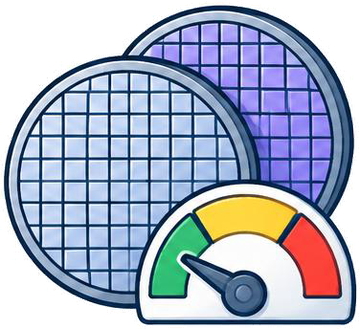<br><b>A4 · Product quality and yield inference</b></a><br><sub>Will a product meet its quality requirements?</sub></td>
</tr>
<tr>
<td width="50%" valign="top"><a href="papers/artifacts.md#a5">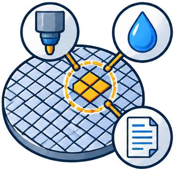<br><b>A5 · Yield-loss diagnosis and root-cause analysis</b></a><br><sub>What caused a loss of yield, and where should engineers investigate?</sub></td>
<td width="50%" valign="top"><a href="papers/artifacts.md#a6">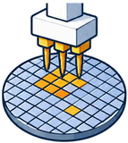<br><b>A6 · Adaptive testing and inspection</b></a><br><sub>Which dies or locations should be tested or inspected next?</sub></td>
</tr>
</table>

<table>
<tr><td colspan="2" width="900">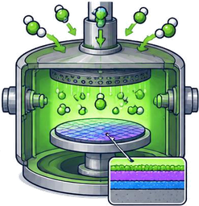<h3><a href="papers/processes.md">Processes</a></h3><b>How do we make it?</b><br>Measurements, recipes and control.</td></tr>
<tr>
<td width="50%" valign="top"><a href="papers/processes.md#p1">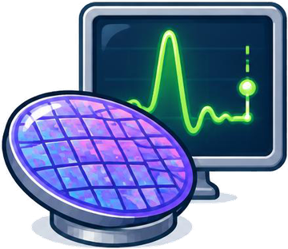<br><b>P1 · Process monitoring and endpoint detection</b></a><br><sub>Is a process running normally, and when should it stop?</sub></td>
<td width="50%" valign="top"><a href="papers/processes.md#p2"><br><b>P2 · Virtual metrology</b></a><br><sub>Can sensor data estimate a measurement that is slow or expensive to obtain?</sub></td>
</tr>
<tr>
<td width="50%" valign="top"><a href="papers/processes.md#p3"><br><b>P3 · Process development and recipe optimization</b></a><br><sub>Which process settings or experiments should be tried next?</sub></td>
<td width="50%" valign="top"><a href="papers/processes.md#p4">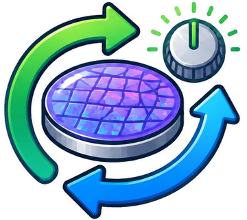<br><b>P4 · Run-to-run and feedback control</b></a><br><sub>How should settings change after observing a process result?</sub></td>
</tr>
</table>

<table>
<tr><td colspan="2" width="900">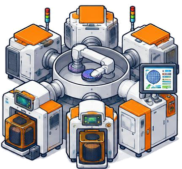<h3><a href="papers/equipment.md">Equipment</a></h3><b>Can the tools do the job?</b><br>Tool health, maintenance and readiness.</td></tr>
<tr>
<td width="50%" valign="top"><a href="papers/equipment.md#e1">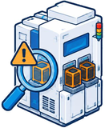<br><b>E1 · Fault detection and diagnosis</b></a><br><sub>Is a tool faulty, and which fault explains its signals?</sub></td>
<td width="50%" valign="top"><a href="papers/equipment.md#e2"><br><b>E2 · Prognostics and maintenance</b></a><br><sub>When is a tool likely to fail, and when should it be maintained?</sub></td>
</tr>
<tr>
<td width="50%" valign="top"><a href="papers/equipment.md#e3"><br><b>E3 · Calibration, matching and qualification</b></a><br><sub>Is a tool or chamber ready for a specified manufacturing operation?</sub></td>
<td></td>
</tr>
</table>

<table>
<tr><td colspan="2" width="900">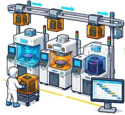<h3><a href="papers/production.md">Production</a></h3><b>What should happen next?</b><br>Lots, schedules and material flow.</td></tr>
<tr>
<td width="50%" valign="top"><a href="papers/production.md#r1"><br><b>R1 · Cycle-time and delivery prediction</b></a><br><sub>When will a lot finish, and will it be delivered on time?</sub></td>
<td width="50%" valign="top"><a href="papers/production.md#r2">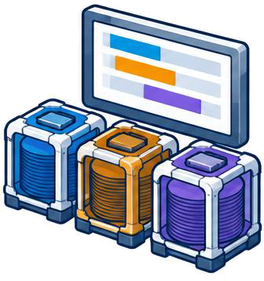<br><b>R2 · Scheduling and dispatching</b></a><br><sub>Which job should each machine process next?</sub></td>
</tr>
<tr>
<td width="50%" valign="top"><a href="papers/production.md#r3">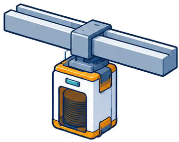<br><b>R3 · Material handling</b></a><br><sub>How should wafers move between tools?</sub></td>
<td width="50%" valign="top"><a href="papers/production.md#r4">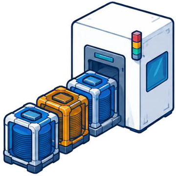<br><b>R4 · Bottleneck and production-state analysis</b></a><br><sub>Where is production constrained, and what factory state explains the delay?</sub></td>
</tr>
</table>

<table>
<tr><td colspan="2" width="900"><h3><a href="papers/fabs.md">Fabs</a></h3><b>What keeps the factory running?</b><br>Utilities, resources and capacity.</td></tr>
<tr>
<td width="50%" valign="top"><a href="papers/fabs.md#f1"><br><b>F1 · Utility and resource operation</b></a><br><sub>How should cooling, power, air and water systems serve production efficiently?</sub></td>
<td width="50%" valign="top"><a href="papers/fabs.md#f2">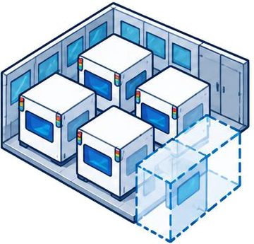<br><b>F2 · Capacity planning</b></a><br><sub>What equipment, qualifications or factory space should be added or reassigned?</sub></td>
</tr>
</table>

[📖 Full bibliography](references.bib) · [🧰 Datasets & code](RESOURCES.md)

## 🤝 Contribute

Have a paper to add or a correction to suggest? [Open an issue](https://github.com/zrrraa/Awesome-AI-Assisted-Semiconductor-Manufacturing/issues/new/choose) or follow the [contribution guide](CONTRIBUTING.md) to send a pull request. The collection will grow with the field.
